<!-- Hero: macOS Terminal System Readout -->

  

# Noel Yang
### Senior Data Scientist @ Micron Technology · Agentic AI & Autonomous Systems

> Taichung, Taiwan &nbsp;·&nbsp; Primary: Enterprise Agentic AI &amp; Industrial LLMs &nbsp;·&nbsp; Side Alpha: Systematic Quantitative Research

---

## 🏛️ Systems & Engineering Architecture

### 01. Enterprise Agentic AI & Industrial LLMs *(Primary Focus · Micron Technology)*
Architecting autonomous reasoning systems and multi-agent workflows for complex industrial intelligence challenges:
* **Multi-Agent Orchestration**: Building stateful multi-agent execution graphs, dynamic task delegation, subagent synthesis, and deterministic routing patterns.
* **Tool-Use & Function Calling**: Designing resilient function-calling interfaces with strict schema validation, exception recovery, and execution trace observability.
* **Enterprise Context & Memory**: Scalable Retrieval-Augmented Generation (RAG) with hybrid dense/sparse vector search over proprietary technical corpora.
* **Production Guardrails & Evaluation**: Automated multi-perspective judge pipelines, synthetic stress-testing, and inference latency/token budget optimization.

### 02. Autonomous Quantitative Trading Engine *(Side Alpha · Personal Research)*
A decoupled, object-oriented systematic trading and portfolio risk management system running automated live execution across Taiwan equities and US leveraged ETFs:
* **`GA-047 (Adaptive-ML)`**: Market-Cap Adaptive 6-Model GBDT Ensemble + Triple Macro Gates (*7-Year Out-of-Sample Sharpe 3.80 / MDD -10.55%*).
* **`PRAD-007 (Regime-Drift)`**: Post-Revenue Announcement Drift (SUE Z-Score) + Institutional Co-trading + 200 SMA Filter (*Sharpe 2.17 / MDD -14.65%*).
* **`MOM-003 (TQQQ-Dual)`**: Dual-regime trend acceleration with dynamic volatility deleveraging on US leveraged assets.
* **Headless Operations**: Automated daily cron execution, broker risk rebalancing, and live telemetry dispatch via Discord webhooks.
* 📄 **Research Publication**: [**Read the Quantitative Strategy Whitepaper ↗**](https://noeltw.github.io/quant-research/) *(Published on GitHub Pages)*
* 🔒 **Core Codebase**: `[Proprietary Research Engine · Private]`

---

## ⚙️ Technical Matrix

| Domain | Core Technologies & Methodologies |
| :--- | :--- |
| **Agentic AI & LLMs** | Multi-Agent Frameworks, LangGraph, Tool-Use & Function Calling, Autonomous Workflows, LLM Evaluator Harnesses, RAG Architecture |
| **Machine Learning & Modeling** | GBDT Ensembles (LightGBM, CatBoost, XGBoost), PyTorch, Optuna Hyperparameter Search, Genetic Algorithm Feature Optimization |
| **Data Engineering & Infra** | Python (uv package management), FastAPI, Docker, Linux / Zsh, PostgreSQL, Vector Databases, Asynchronous Task Pipelines |
| **Quantitative Finance** | Vectorized Backtesting (FinLab), SUE Factor Mining, Volatility Targeting, 3-Tier Macro Regime Circuit Breakers |

---

## 📊 Telemetry & Activity

  <table border="0" cellspacing="0" cellpadding="0">
    <tr>
      <td align="center" valign="middle">
        
      </td>
      <td align="center" valign="middle">
        
      </td>
    </tr>
  </table>
   
  

---

## 📬 Contact & Connect

  
  &nbsp;&nbsp;
  

